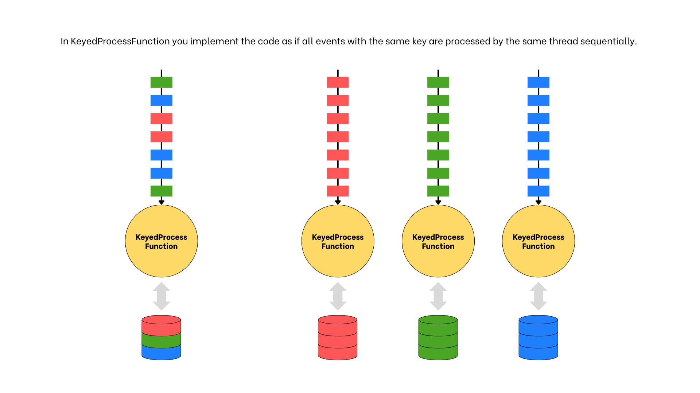

# Low-level DataStream API

## Exercise 1: Station Inactivity

**Goal:** Implement station inactivity detection — if there are no new events for a given station within a specified
time, generate a notification.

---

**KeyedProcessFunction Introduction**

Before we start discussing how to implement the function, let's analyze `KeyedProcessFunction` high-level anatomy.

`KeyedProcessFunction` is the most commonly used variant of processing functions. It is applied on a single keyed
`DataStream`.

```java
public static void main(String[] args) throws Exception {
    final StreamExecutionEnvironment env = StreamExecutionEnvironment.getExecutionEnvironment();
    env.fromSource(source)
            .assignTimestampsAndWatermarks(watermarkingStrategy)
            .keyBy(e -> Tuple2.of(e.getLine(), e.getStation()), Types.TUPLE(Types.INT, Types.INT))
            .process(new StationInactivityDetectionV1(Duration.ofMinutes(5).toMillis()))
            .sinkTo(sink);
}
```

```java
class StationInactivityDetectionV1
        extends KeyedProcessFunction<Tuple2<Integer, Integer>, ProcessingEvent, InactivityAlert> {
}
```

where:

```java
/**
 * @param <K> Type of the key.
 * @param <I> Type of the input elements.
 * @param <O> Type of the output elements.
 */
public abstract class KeyedProcessFunction<K, I, O>
```

`KeyedProcessFunction` exposes basic building blocks such as:

- **events** - each event can be processed individually, like in plain `map()` function.
    ```java
    public abstract void processElement(I value, Context ctx, Collector<O> out);
    ```
- **states** - a custom context related to a given key that is stored in state. State is bound to given key! There are a
  few state types: `ValueState`, `MapState` and `ListState`.
    ```java
    private transient ValueState<Long> myState;

    Long myValue = myState.value();
    
    private transient MapState<String, Long> myMapState;
  
    Long myKeyedValue = myMapState.get("some-key");
    ```
- **timers** - a callback registered at given timestamp, which allows to take deferred actions in the future. Timer is
  bound to given key!
    ```java
    ctx.timerService().registerEventTimeTimer(timestamp);
    ctx.timerService().deleteEventTimeTimer(timestamp);
    ```

---

**Version 1** - Naive approach

In the first version (`StationInactivityDetectionV1`), we simply assume that events arrive in perfect order. The
algorithm is straightforward: for each event, we store the `last-seen` timestamp in state and schedule a timer
`inactivityPeriodMs` milliseconds into the future. If a newer event arrives before the inactivity period expires, we
update the `last-seen` value and register a new timer. When the timer fires, it indicates that the inactivity period has
passed and a notification can be emitted.

The first step is to create `last-seen` value store in `open()`:

```java
private transient ValueState<Long> lastSeenState;

@Override
public void open(OpenContext openContext) {
    lastSeenState = getRuntimeContext().getState(new ValueStateDescriptor<>("last-seen", Types.LONG));
}
```

Then, for each element in `processElement()`:

- We extract the event time from the context (`ctx.timestamp()`).
- If `lastSeen` is null (i.e., `lastSeenState` is empty), then the current event is either the first one ever or the
  first one after the previous notification. In this case, we update the state and register a timer.
- Otherwise, we need to cancel the previously started countdown. To do this, we delete the previous timer and register a
  new one.

```java

@Override
public void processElement(Event value,
                           KeyedProcessFunction<Long, Event, InactivityAlert>.Context ctx,
                           Collector<InactivityAlert> out) throws IOException {
    long timestamp = ctx.timestamp();
    Long lastSeen = lastSeenState.value();
    if (lastSeen == null) {
        lastSeenState.update(timestamp);
        ctx.timerService().registerEventTimeTimer(timestamp + inactivityPeriodMs);
    } else {
        lastSeenState.update(timestamp);
        ctx.timerService().deleteEventTimeTimer(lastSeen + inactivityPeriodMs);
        ctx.timerService().registerEventTimeTimer(timestamp + inactivityPeriodMs);
    }
}
```

When timer fires, we emit `InactivityAlert` and clear the state.

```java

@Override
public void onTimer(long timestamp,
                    KeyedProcessFunction<Long, Event, InactivityAlert>.OnTimerContext ctx,
                    Collector<InactivityAlert> out) throws Exception {
    out.collect(new InactivityAlert(ctx.getCurrentKey(), lastSeenState.value()));
    lastSeenState.clear();
}
```

---

Key observations when using `KeyedProcessFunction`.

- Flink distributes stream records based on the key – each key is processed by exactly one operator subtask.
- We can imagine that events with the same key are processed by the same thread sequentially. No need to worry about
  concurrency!
- Flink takes advantage of this locality – state related with given key is kept on the same machine.



---

Let's analyze how Flink processes a stream of events in `KeyedProcessFunction`.


---

**Version 2** - Buffering

The first version of the job works only if the events are ordered perfectly. This is rarely the case - usually they come
out-of-order. The usual approach is to buffer the events until the watermark progresses.

The first step is to create `buffer` map store and `last-seen` value store:

```java
private transient MapState<Long, Event> buffer;
private transient ValueState<Long> lastSeenState;

@Override
public void open(OpenContext openContext) {
    buffer = getRuntimeContext()
            .getMapState(new MapStateDescriptor<>("buffer", Types.LONG, TypeInformation.of(Event.class)));
    lastSeenState = getRuntimeContext()
            .getState(new ValueStateDescriptor<>("last-seen", Types.LONG));
}
```

For each element:

- Drop late events.
- Put event into the buffer.
- Register timer when the event can be taken from the buffer and processed.

```java

@Override
public void processElement(Event value,
                           KeyedProcessFunction<Long, Event, InactivityAlert>.Context ctx,
                           Collector<InactivityAlert> out) throws Exception {
    long timestamp = ctx.timestamp();
    if (timestamp < ctx.timerService().currentWatermark()) {
        log.debug("Late event: {}.", value);
        return;
    }

    buffer.put(timestamp, value);
    ctx.timerService().registerEventTimeTimer(timestamp);
}
```

The timer may fire for two reasons:

1. Inactivity timer has been registered.
2. Event can be taken from the buffer and processed (watermark >= event time).

```java

@Override
public void onTimer(long timestamp,
                    KeyedProcessFunction<Long, Event, InactivityAlert>.OnTimerContext ctx,
                    Collector<InactivityAlert> out) throws Exception {
    // Event-time timer can be fired:
    // (1) when inactivity period has expired.
    // (2) when the event is ready for processing; by buffering events we ensure they are processed in order.
    checkInactivityPeriod(timestamp, ctx, out);
    processBufferedEvents(timestamp, ctx);
}

private void checkInactivityPeriod(long timestamp,
                                   KeyedProcessFunction<Long, Event, InactivityAlert>.OnTimerContext ctx,
                                   Collector<InactivityAlert> out) throws IOException {
    Long lastSeen = lastSeenState.value();
    if (lastSeen != null && lastSeen + inactivityPeriodMs <= timestamp) {
        lastSeenState.clear();
        out.collect(new InactivityAlert(ctx.getCurrentKey(), lastSeen));
    }
}

private void processBufferedEvents(long timestamp,
                                   KeyedProcessFunction<Long, Event, InactivityAlert>.OnTimerContext ctx) throws Exception {
    Event event = buffer.get(timestamp);
    if (event != null) {
        buffer.remove(timestamp);
        lastSeenState.update(timestamp);
        ctx.timerService().registerEventTimeTimer(timestamp + inactivityPeriodMs);
    }
}
```
