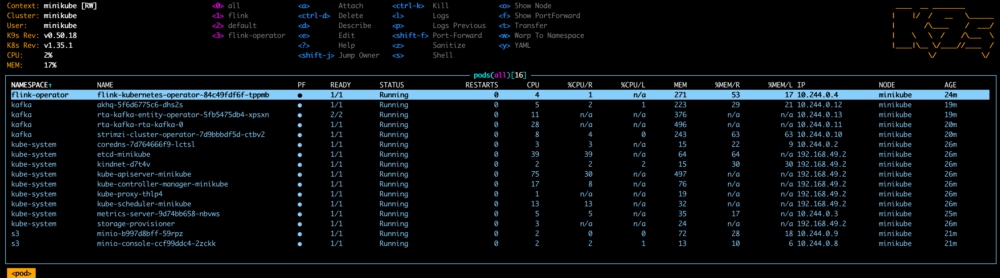
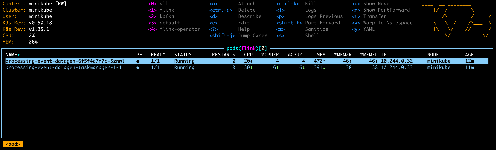
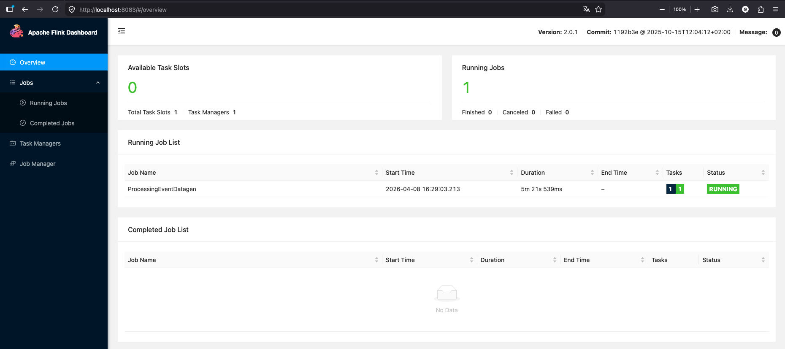

# flink-k8s-deployment

In this module we will deploy and then upgrade a Flink job.

---

## Deployment

1. Ensure that minikube stack and all required components are installed properly:
    - `k8s/00-k8s`
    - `k8s/01-flink-operator`
    - `k8s/02-minio`
    - `k8s/03-kafka`
    - `k8s/04-akhq`
    
   Using `k9s` or `kubectl` check if all services are up and running.
   

2. Build and deploy the job artifact to minio:
   ```bash
   mvn clean deploy -pl flink-common,flink-k8s-deployment -DskipTests
   ```
   The fat JAR will be uploaded to minio at `s3://flink/flink-k8s-deployment-1.0.jar`.

3. Deploy `com.xebia.flink.workshop.deployment.ProcessingEventDatagen` job. It will start adding rows to a Kafka topic.
   ```bash
   kubectl apply -f flink-k8s-deployment/k8s/processing-event-datagen.yaml
   ```

4. Deploy `com.xebia.flink.workshop.deployment.ProcessingEventJob` job. It consumes events generated by the datagen job started in the previous step.
   ```bash
   kubectl apply -f flink-k8s-deployment/k8s/processing-event-job.yaml
   ```
   Using `k9s` or `kubectl` check if the jobs are up and running.
   
   You can also check jobs' UI at `http://localhost:8083` and `http://localhost:8084`.
   

---

## Job upgrade

1. Modify `ProcessingEventJob` and corresponding models in a backward-compatible way. For example, calculate and emit
   average processing time.

2. Bump version, build and upload the updated artifact to MinIO:
   ```bash
   mvn versions:set -DnewVersion=1.1 -DgenerateBackupPoms=false
   mvn clean deploy -pl flink-common,flink-k8s-deployment -DskipTests
   ```

3. Update `FlinkDeployment` with the new jar URI and apply changes.
   ```yaml
    job:
      jarURI: s3://flink/flink-k8s-deployment-1.1.jar
   ```
   ```bash
   kubectl apply -f flink-k8s-deployment/k8s/processing-event-job.yaml
   ```
   Using `k9s` or `kubectl` check if the job is up and running.

   The old job logs should contain logs indicating it is being stopped with a savepoint.
   ```
   2026-05-04 11:29:31,179 INFO  org.apache.flink.runtime.jobmaster.JobMaster                 [] - Triggering stop-with-savepoint for job d65bb5191fcba53c654671801e9843ea.
   2026-05-04 11:29:31,270 INFO  org.apache.flink.runtime.checkpoint.CheckpointCoordinator    [] - Triggering checkpoint 3 (type=SavepointType{name='Suspend Savepoint', postCheckpointAction=SUSPEND, formatType=CANONICAL}) @ 1777894171185 for job d65bb5191fcba53c654671801e9843ea.
   ```

   The new job logs should contain logs indicating it is being started from a savepoint.
   ```
   2026-05-04 11:30:01,035 INFO  org.apache.flink.runtime.checkpoint.CheckpointCoordinator    [] - Restoring job 2621f29c228b38ef1386314d173bbe4a from Savepoint 3 @ 0 for 2621f29c228b38ef1386314d173bbe4a located at s3://flink/processing-event-job/savepoints/savepoint-d65bb5-83c922d9a48c.
   ```
   
   If your change is incompatible, you may see an error as below:
   ```
   2026-05-04 11:46:51,047 INFO  org.apache.flink.runtime.executiongraph.ExecutionGraph       [] - station-event-counter -> Sink: Print to Std. Out (1/1) (c9c14c3ca0f8532f09bd90778ff99d24_f505244c1e3d52f774d97fe1b9c2f680_0_1) switched from INITIALIZING to FAILED on processing-event-job-taskmanager-1-1 @ 10.244.0.26 (dataPort=45467).
   java.lang.RuntimeException: Error while getting state
     at org.apache.flink.runtime.state.DefaultKeyedStateStore.getState(DefaultKeyedStateStore.java:91) ~[flink-dist-2.2.0.jar:2.2.0]
     at org.apache.flink.streaming.api.operators.StreamingRuntimeContext.getState(StreamingRuntimeContext.java:207) ~[flink-dist-2.2.0.jar:2.2.0]
     at com.xebia.flink.workshop.deployment.ProcessingEventJob$StationDurationTracker.open(ProcessingEventJob.java:57) ~[?:?]
     at org.apache.flink.api.common.functions.util.FunctionUtils.openFunction(FunctionUtils.java:34) ~[flink-dist-2.2.0.jar:2.2.0]
     at org.apache.flink.streaming.api.operators.AbstractUdfStreamOperator.open(AbstractUdfStreamOperator.java:107) ~[flink-dist-2.2.0.jar:2.2.0]
     at org.apache.flink.streaming.api.operators.KeyedProcessOperator.open(KeyedProcessOperator.java:54) ~[flink-dist-2.2.0.jar:2.2.0]
     at org.apache.flink.streaming.runtime.tasks.RegularOperatorChain.initializeStateAndOpenOperators(RegularOperatorChain.java:107) ~[flink-dist-2.2.0.jar:2.2.0]
     at org.apache.flink.streaming.runtime.tasks.StreamTask.restoreStateAndGates(StreamTask.java:866) ~[flink-dist-2.2.0.jar:2.2.0]
     at org.apache.flink.streaming.runtime.tasks.StreamTask.lambda$restoreInternal$5(StreamTask.java:820) ~[flink-dist-2.2.0.jar:2.2.0]
     at org.apache.flink.streaming.runtime.tasks.StreamTaskActionExecutor$1.call(StreamTaskActionExecutor.java:55) ~[flink-dist-2.2.0.jar:2.2.0]
     at org.apache.flink.streaming.runtime.tasks.StreamTask.restoreInternal(StreamTask.java:820) ~[flink-dist-2.2.0.jar:2.2.0]
     at org.apache.flink.streaming.runtime.tasks.StreamTask.restore(StreamTask.java:779) ~[flink-dist-2.2.0.jar:2.2.0]
     at org.apache.flink.runtime.taskmanager.Task.runWithSystemExitMonitoring(Task.java:973) ~[flink-dist-2.2.0.jar:2.2.0]
     at org.apache.flink.runtime.taskmanager.Task.restoreAndInvoke(Task.java:945) ~[flink-dist-2.2.0.jar:2.2.0]
     at org.apache.flink.runtime.taskmanager.Task.doRun(Task.java:760) ~[flink-dist-2.2.0.jar:2.2.0]
     at org.apache.flink.runtime.taskmanager.Task.run(Task.java:569) ~[flink-dist-2.2.0.jar:2.2.0]
     at java.base/java.lang.Thread.run(Unknown Source) ~[?:?]
   Caused by: org.apache.flink.util.StateMigrationException: For heap backends, the new state serializer (org.apache.flink.api.java.typeutils.runtime.PojoSerializer@5a72351e) must not be incompatible with the old state serializer (org.apache.flink.api.java.typeutils.runtime.PojoSerializer@d81a669e).
     at org.apache.flink.runtime.state.heap.HeapKeyedStateBackend.tryRegisterStateTable(HeapKeyedStateBackend.java:259) ~[flink-dist-2.2.0.jar:2.2.0]
     at org.apache.flink.runtime.state.heap.HeapKeyedStateBackend.createOrUpdateInternalState(HeapKeyedStateBackend.java:435) ~[flink-dist-2.2.0.jar:2.2.0]
     at org.apache.flink.runtime.state.heap.HeapKeyedStateBackend.createOrUpdateInternalState(HeapKeyedStateBackend.java:422) ~[flink-dist-2.2.0.jar:2.2.0]
     at org.apache.flink.runtime.state.KeyedStateFactory.createOrUpdateInternalState(KeyedStateFactory.java:47) ~[flink-dist-2.2.0.jar:2.2.0]
     at org.apache.flink.runtime.state.ttl.TtlStateFactory.createStateAndWrapWithTtlIfEnabled(TtlStateFactory.java:70) ~[flink-dist-2.2.0.jar:2.2.0]
     at org.apache.flink.runtime.state.AbstractKeyedStateBackend.getOrCreateKeyedState(AbstractKeyedStateBackend.java:394) ~[flink-dist-2.2.0.jar:2.2.0]
     at org.apache.flink.runtime.state.AbstractKeyedStateBackend.getPartitionedState(AbstractKeyedStateBackend.java:447) ~[flink-dist-2.2.0.jar:2.2.0]
     at org.apache.flink.runtime.state.DefaultKeyedStateStore.getPartitionedState(DefaultKeyedStateStore.java:150) ~[flink-dist-2.2.0.jar:2.2.0]
     at org.apache.flink.runtime.state.DefaultKeyedStateStore.getState(DefaultKeyedStateStore.java:89) ~[flink-dist-2.2.0.jar:2.2.0]
     ... 16 more
   ```
