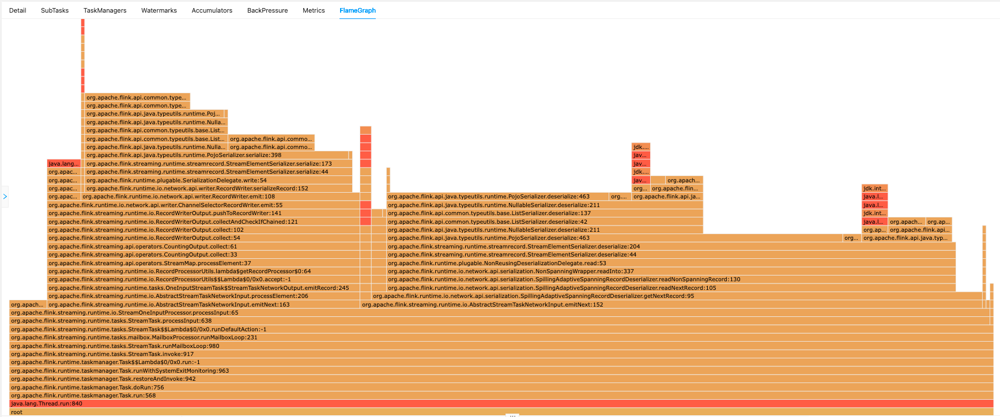
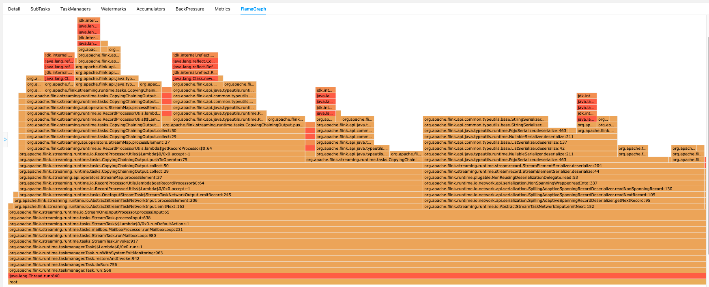
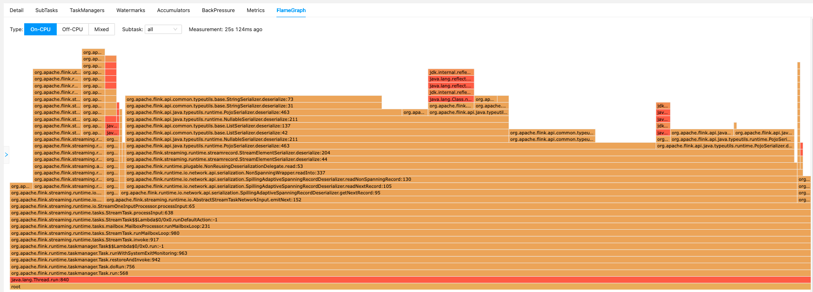

# flink-optimisations

## reinterpretAsKeyedStream

### Benchmarks

If you run the benchmark directly from IDE, the results may be surprising - benchmark **without**
`reinterpretAsKeyedStream` is more performant than benchmark **with** `reinterpretAsKeyedStream`! Why?

```
Benchmark                                                         Mode  Cnt     Score     Error   Units
ReinterpretBenchmarks.withoutReinterpretWithObjectReuseDisabled  thrpt   14  3490,302 ±  65,780  ops/ms
ReinterpretBenchmarks.withoutReinterpretWithObjectReuseEnabled   thrpt   14  3513,595 ± 273,948  ops/ms
ReinterpretBenchmarks.withReinterpretWithObjectReuseDisabled     thrpt   14  2629,400 ±  39,415  ops/ms
ReinterpretBenchmarks.withReinterpretWithObjectReuseEnabled      thrpt   14  5204,786 ±  66,634  ops/ms
```

**Explanation**: As you may remember from the slides, Flink uses a slot sharing mechanism that allows multiple tasks to
run within a single task slot. In our benchmark, the parallelism is set to 3. Let's analyze the job execution graphs.

Job graph without `reinterpretAsKeyedStream`:

```
(Source) -- hash --> (Map) -- hash --> (Map) -- hash --> (Map -> Sink)
```

Job graph with `reinterpretAsKeyedStream`:

```
(Source) -- hash --> (Map -> Map -> Map -> Sink)
```

With **parallelism=3**, the first job needs to assign **3*4=12** tasks across 3 task slots, while the second one needs to
assign **3*2=6** tasks across 3 task slots. Each task is executed by a **separate thread**, so the first job uses
12 threads, while the second job uses up to 6 threads. In fact, Flink does not limit CPU usage per task slot -
each task can consume all available CPU resources. Therefore, the first job is faster only because it can use more CPUs
(12 vs 6).

To make the comparison fair, we need to limit CPU usage to at most 3 cores. To achieve this, we can run the benchmarks
in a Docker container.

```
Benchmark                                                         Mode  Cnt     Score    Error   Unit
ReinterpretBenchmarks.withoutReinterpretWithObjectReuseDisabled  thrpt   14   824.250 ± 68.996  ops/ms
ReinterpretBenchmarks.withoutReinterpretWithObjectReuseEnabled   thrpt   14   865.025 ± 23.811  ops/ms
ReinterpretBenchmarks.withReinterpretWithObjectReuseDisabled     thrpt   14  2099.875 ± 78.122  ops/ms
ReinterpretBenchmarks.withReinterpretWithObjectReuseEnabled      thrpt   14  3335.597 ± 66.603  ops/ms
```

---

### Flamegraphs

**Flamegraph - no reinterpret**

Run `JobWithoutReinterpret.java` and open `http://localhost:8083` (Flink UI) in your browser.

Most of the time the job is deserializing incoming events and serializing outgoing events.



---

**Flamegraph - reinterpret**

Run `JobWithReinterpret.java` and open `http://localhost:8083` (Flink UI) in your browser.

Most of the time, the job is deserializing incoming events and cloning events between operators within the task.



---

**Flamegraph - reinterpret + object reuse**

With object reuse, the vast majority of time is spent on deserialization.


